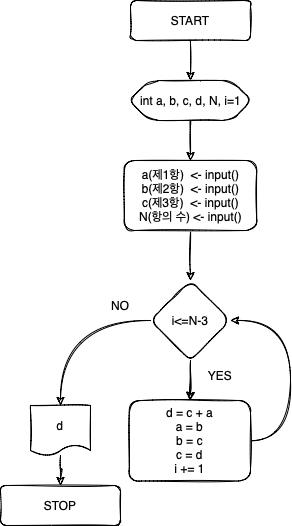
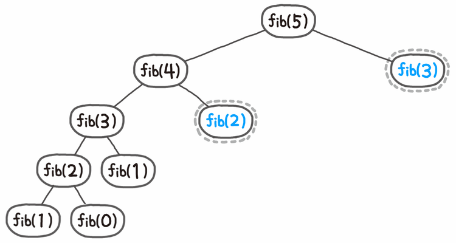

# SW3106 : 프로그래밍 입문 Project #1

### 1-1. Problem1_FlowChart

### 1-2. Problem1_iteration
|점화식|
|:---|
F(n+3) = F(n+2) + Fn (n=1, 2, 3 ...)


F1 = 1, F2 = 2, F3 = 3이라 하고 <span style="color:red">**10**</span>번째 항의 수를 구한다고 해보자.
|시행수(i)|F(i)|F(i+1)|F(i+2)|F(i+3)|
|:---:|:---:|:---:|:---:|:---:|
|1|1|2|3|4|
|2|2|3|4|6|
|3|3|4|6|9|
|4|4|6|9|13|
|5|6|9|13|19|
|6|9|13|19|28|
|**7**|**13**|**19**|**28**|<span style="color:red">**41**</span>||

여기서 알 수 있는 것은 시행수가 i일 때, i+3번째 값을 구할 수 있다.
즉, i-3번 반복하면 i번째 값을 구할 수 있다.
```c
[Prob1 iteration: Main Source Code]

#include <stdio.h>

int main(void)
{
    /* 변수 선언 부분: 수정하지 마세요 */
    int a, b, c, n; // 제 1항, 제 2항, 제 3항, 항의 수
    int output;  // 출력하고자 하는 값(제 n항)을 output 변수에 저장하세요.
    /* ------------------------------ */

    /* 입력 부분: 수정하지 마세요 */
    printf("제 1항(a), 제 2항(b), 제 3항(c), 항의 수(N)을 입력하세요:\n");
    scanf("%d%d%d%d",&a,&b,&c,&n);
    /* ---------------------------*/
    int i;
    for(i = 1; i <= n-3; i++) {
        output = c + a;
        a = b;
        b = c;
        c = output;
    }


    /* 출력 부분: 수정하지 마세요 */  
    printf("%d항: %d",n,output);
	/* -------------------------- */ 

    return 0;
}

```
### 1-3. Problem1_recursive
|피보나치 점화식|
|:---|
Fib(n+2) = Fib(n+1) + Fib(n) (n=1, 2, 3 ...)

위와 같이 5번째 피보나치 수열을 구하는 데 함수 f를 호출하는 횟수는 총 15번이다. 위의 예시에서 중복해서 계산하는 값만 따져 봐도 Fib(3)이 2번, Fib(2)가 3번, Fib(1)을 5번, Fib(0)을 3번 계산한다. 15번의 계산 중에 무려 11번을 중복해서 계산하는 셈이다. 비록 위 예시는 비교적 작은 값을 제시했지만, 피보나치 수열을 순진(naive)한 방법으로 구할 경우 시간복잡도는 피보나치 수열의 값에 따라 폭발적으로 증가한다. 즉 O(2^N)다.

하지만 메모이제이션(Memoization) 기법을 사용하면 한 번 계산한 결과를 메모리에 저장해두었다가 꺼내 씀으로써 중복 계산을 방지할 수 있고 이를 이용하면 O(N)이 되며 Fib(5)를 구하는 과정은 위와 같아진다.
문제 조건에 맞게 메모이제이션을 적용하면 아래 소스코드와 같이 구현할 수 있다.

[Prob1 recursive : Main Source Code]

```c
#include <stdio.h>

int d[100] = {0};

int fibo(int a, int b, int c, int n) {
    if (n == 1) 
        return a;
    if (n == 2)
        return b;
    if (n == 3)
        return c;
    if (d[n] != 0)
        return d[n];
    
    return d[n] = fibo(a, b, c, n - 1) + fibo(a, b, c, n - 3);
}

int main(void)
{
    /* 변수 선언 부분: 수정하지 마세요 */
    int a, b, c, n; // 제 1항, 제 2항, 제 3항, 항의 수
    int output;  // 출력하고자 하는 값(제 n항)을 output 변수에 저장하세요.
    /* ------------------------------ */

    /* 입력 부분: 수정하지 마세요 */
    printf("제 1항(a), 제 2항(b), 제 3항(c), 항의 수(N)을 입력하세요:\n");
    scanf("%d%d%d%d",&a,&b,&c,&n);
    /* ---------------------------*/
    output = fibo(a, b, c, n);


    /* 출력 부분: 수정하지 마세요 */  
    printf("%d항: %d",n,output);
	/* -------------------------- */ 

    return 0;
}

```

### 2. Problem2
각 메뉴의 수량을 입력받고 만약 모든 수량 중 0이 없을 때 가장 작은 수량을 기준으로 세트 메뉴를 구성한 뒤 제일 작은 수량만큼 모든 메뉴으 수량을 빼주고 만약 0이 하나라도 존재한다면 세트를 구성할 수 없으니 그냥 출력하게 한다. 단, 수량이 0보다 클 때 출력을 하도록 설정하면 소스코드는 아래와 같다.

[Prob2 : Main Source Code]

```c
#include <stdio.h>

int main(void)
{
    /* 변수 선언 부분: 수정하지 마세요 */
    int price_coffee = 4000; // 커피, 케잌, 샌드위치 가격
    int price_cake = 5000;
    int price_sandwich = 6000;
    int price_set = 12000;
    int num_coffee; // 커피, 케잌, 샌드위치 주문 수량
    int num_cake;
    int num_sandwich;
    int num_set;
    int total_price; // 합계 금액
    /* ------------------------------ */

    /* 입력 부분: 수정하지 마세요 */
    printf("주문하고자 하는 커피, 케잌, 샌드위치의 갯수를 각각 입력하세요:\n");
    scanf("%d%d%d",&num_coffee,&num_cake,&num_sandwich);
    /* -------------------------- */

    int temp[3] = {num_coffee, num_cake, num_sandwich};
    int i;
    int min = temp[0];

    // 만약 수량 중 0이 있다면 min이 0이 되면서 자동으로 반복문이 탈출되고,
    // 수량에서 min을 빼봤자 0을 빼는 것이기에 의미 없다.
    for(i=0; i<3; i++) {
        if(min > temp[i])
            min = temp[i];

        if (temp[i] == 0)
            break;
    }

    num_set = min;
    num_coffee -= num_set;
    num_cake -= num_set;
    num_sandwich -= num_set;
    total_price = (price_set * num_set) + (price_coffee * num_coffee) + (price_cake * num_cake) + (price_sandwich * num_sandwich);

    /* 출력 부분: 수정하지 마세요 */
    printf("품목      가격  갯수   금액\n");
    if (num_set > 0)
        printf("세트 %9d %4d %7d\n", price_set, num_set, price_set * num_set);
    if (num_coffee > 0)
        printf("커피 %9d %4d %7d\n", price_coffee, num_coffee, price_coffee * num_coffee);
    if (num_cake > 0)
        printf("케잌 %9d %4d %7d\n", price_cake, num_cake, price_cake * num_cake);
    if (num_sandwich > 0)
        printf("샌드위치 %5d %4d %7d\n", price_sandwich, num_sandwich, price_sandwich * num_sandwich);
    printf("----------------------------\n");
    printf("총 지불 금액 %14d", total_price);
    /* ------------------------- */

    return 0;
}
```

### 3. Problem3

먼저 입력받은 정수를 16자리의 이진수로 표현하기 위해 0xFFFF와 AND 연산을 한다.

&연산을 마친 데이터를 target이라는 변수에 대입하고 맨 처음부터 하나씩 >> 시프트 연산을 한다. 만약 입력받은 데이터가 17이라는 정수라고 하자. 그럼 target이 의미하는 데이터는 0000000000010001일 것이다. 

제일 앞에 있는 숫자는 target>>15로 시프트 연산한 뒤 0b01 즉, 10진수 기준 1과 &연산하여 해당 숫자가 0인지 1인지 판단한다.
이 과정에서 기본적으로 0은 출력하지 않지만 처음으로 1이 나온 시점부터 이후의 0들은 의미가 있기에 find라는 변수를 만들어 처음으로 1이 나온 시점부턴 0도 같이 출력하도록 제어한다.

[Prob3 : Main Source Code]
```c
#include <stdio.h>
void binaryFunc(int n);

int main()
{
    /* 변수 선언 부분: 수정하지 마세요 */
	int n; // 이진수로 변환하고자 하는 십진수
    /* ------------------------------- */

    /* 입력 부분: 수정하지 마세요 */
    printf("2진수로 출력하고자 하는 수를 입력하세요:\n");
    scanf("%d",&n);
    /* -------------------------- */


    /* 출력 부분: 수정하지 마세요 */
    printf("이진수 출력: ");
	binaryFunc(n);
    /* -------------------------- */
	
  return 0;
}

void binaryFunc(int n) {
    unsigned short int target = (n&0xFFFF);
    char find = 0;

    for(int i=15; i>-1; i--)
	{
        if(find == 0 && ((target>>i)&0b01) == 0)
		{
		}else{
			find = 1;
			printf("%d", ((target>>i)&0b01));
		}
	}
    printf("\n");
}
```

### 4. Problem4
4번 문제에서 나온 특징을 가지는 이진수를 간단히 <span style="color:green">**이친수**</span>라고 하자. 일단 문제에서 요구한 것은 다음과 같다

1. 이친수의 개수를 출력하기
2. 배열의 첫 원소는 n자리수, 그다음으로는 n자리수의 모든 이친수
3. 모든 이친수 출력하기

이것을 해결하기 전에 먼저 알아보아야 할 것이 있다.

|n=1|n=2|n=3|n=4|n=5|n=6|
|:---:|:---:|:---:|:---:|:---:|:---:|
|1|10|100|1000|10000|100000|
|||101|1001|10001|100001|
||||1010|10010|100010|
|||||10100|100100|
|||||10101|100101|
||||||101000|
||||||101001|
||||||101010|
|**1**개|**1**개|**2**개|**3**개|**5**개|**8**개|

여기서 우리는 이친수의 갯수가 피보나치 수열과 같다는 것을 알 수 있다. 그렇기 때문에 이친수의 갯수 점화식은 아래와 같다.

|점화식|
|:---|
F(n+2) = F(n+1) + Fn (n=1, 2, 3 ...)

이제 우리가 알아야 할 것은 이친수의 규칙이다.
위의 이친수 표를 잘 보면 알 수 있지만 n자리수의 이친수는 다음과 같은 과정을 거치면 만들 수 있다.

1. 1 << (n-1)을 한 기본틀
2. n-1자리 이친수들과 1 << (n-2)를 XOR 연산한 결과를 모은다.
3. 1 << (n-1)을 한 기본틀에 2번 결과들과 (n-2)자리 이친수들을 더한다.

n=5일 때를 예로 들어보자.

|n=5|1 << (5-1)|
|:---:|:---:|
|10000|10000|
|10001|
|10010|
|10100|
|10101|

|n=4|^1000|
|:---:|:---:|
|1000|0000|
|1001|0001|
|1010|0010|

|n=3|
|:---:|
|100|
|101|

이를 소스코드로 구현하면 다음과 같다.

[Prob4 : Source Code #1]
```c
#include <stdio.h>
#define MAX 1000
int binaryArray[MAX][MAX] = {0};

int main() {
    int n;
    scanf("%d", &n);

    binaryArray[0][0] = 0b1;
    binaryArray[1][0] = 0b10;

    for(int i=2; i<n; i++) {
        int root = 1 << i;
        int idx_1 = getMaxIdx(binaryArray[i-1]);
        int idx_2 = getMaxIdx(binaryArray[i-2]);
        int new_idx = getMaxIdx(binaryArray[i]);

        for(int j=0; j<idx_1; j++) 
            binaryArray[i][j] = root + (binaryArray[i-1][j] ^ (1 << (i-1)));
        
        new_idx = getMaxIdx(binaryArray[i]);

        for(int j=0; j<idx_2; j++) 
            binaryArray[i][j+new_idx] = root + binaryArray[i-2][j];
    }

    return 0;
}

int getMaxIdx(int* arr) {
    int idx = 0;
    for(int i=0; i<MAX; i++)
        if(arr[i] == 0 && arr[i+1] == 0) {
            idx = i;
            break;
        }
    return idx;
}
```

이차원 배열을 만들어 1 ~ n(입력받은 수)까지의 이친수를 저장한다. 이때 getMaxIdx() 함수의 역할은 n자리 이친수 일차원 배열 기준 이친수가 덜 채워진 부분을 찾아내기 위함이고 이를 이용하여 반복을 돌 때 덜 채워진 부분부터 이친수를 채울 수 있도록 한다.

위의 기능과 문제 조건을 종합적으로 적용한 소스코드는 아래와 같다.

[Prob4 : Main Source Code]
```c
#include <stdio.h>
#define MAX 1000

int MyFinalArray[MAX] = {0};
int binaryArray[MAX][MAX] = {0};
int DP[MAX] = {0};
void getBinary(int n);
int getMaxIdx(int* arr);
void binaryFunc(int n);
int binaryCount(int n);

int main() {
    /* 변수 선언 부분: 수정하지 마세요 */
	int N; // N자리 이진수
    /* ------------------------------- */

    /* 입력 부분: 수정하지 마세요 */
    printf("N을 입력하세요:\n");
    scanf("%d",&N);
    /* -------------------------- */

    //출력 형식은 printf(“%d자리 갯수: %d\n”, 해당하는 변수, 해당하는 변수); 를 이용해주세요.
    // 함수 내 출력 또는 main에서 출력 등 자유롭게 작성 가능

    binaryArray[0][0] = 0b1;
    binaryArray[1][0] = 0b10;

    for(int i=2; i<N; i++) {
        int root = 1 << i;
        int idx_1 = getMaxIdx(binaryArray[i-1]);
        int idx_2 = getMaxIdx(binaryArray[i-2]);
        int new_idx = getMaxIdx(binaryArray[i]);
        
        for(int j=0; j<idx_1; j++)
            binaryArray[i][j] = root + (binaryArray[i-1][j] ^ (1 << (i-1)));
        
        new_idx = getMaxIdx(binaryArray[i]);

        for(int j=0; j<idx_2; j++)
            binaryArray[i][j+new_idx] = root + binaryArray[i-2][j];
    }

    // 문제 조건에 맞는 배열 만들기
	int pinary_cnt = binaryCount(N);
	MyFinalArray[0] = pinary_cnt;
	for(int i=1; i<=pinary_cnt; i++)
		MyFinalArray[i] = binaryArray[N-1][i-1];
    
    
    printf("%d자리 갯수: %d\n", N, MyFinalArray[0]);
    for(int i=0; i<getMaxIdx(binaryArray[N-1]); i++) {	        
        if(i % 10 == 0 && i != 0)
			printf("\n"); 
        binaryFunc(MyFinalArray[i+1]);
    }
    printf("\n");

    return 0;
}

int getMaxIdx(int* arr) {
    int idx = 0;
    for(int i=0; i<MAX; i++)
        if(arr[i] == 0 && arr[i+1] == 0) {
            idx = i;
            break;
        }
    return idx;
}

void binaryFunc(int n) {
    unsigned short int target = (n&0xFFFF);
    char find = 0;
	int str_idx = 0;

	for(int i=15; i>-1; i--) {
		if(find == 0 && ((target>>i)&0x01) == 0)
		{
			//printf(" x");
		}else{
			find = 1;
			printf("%d", ((target>>i)&0x01));
		}
	}
    printf(" ");
}

int binaryCount(int n) {
    if(n == 1) 
        return 1;
    if(n == 2)
        return 1;
    if(DP[n] != 0)
        return DP[n];
    
    return DP[n] = binaryCount(n - 1) + binaryCount(n - 2);
}

```