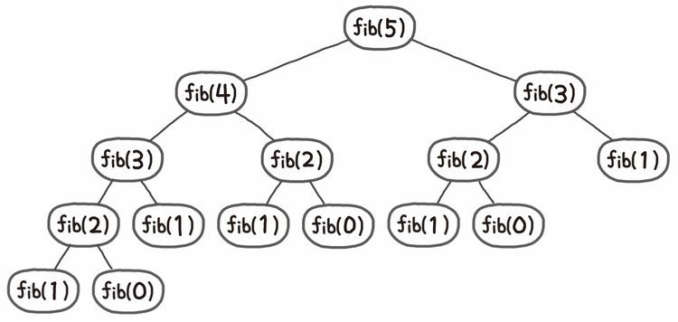
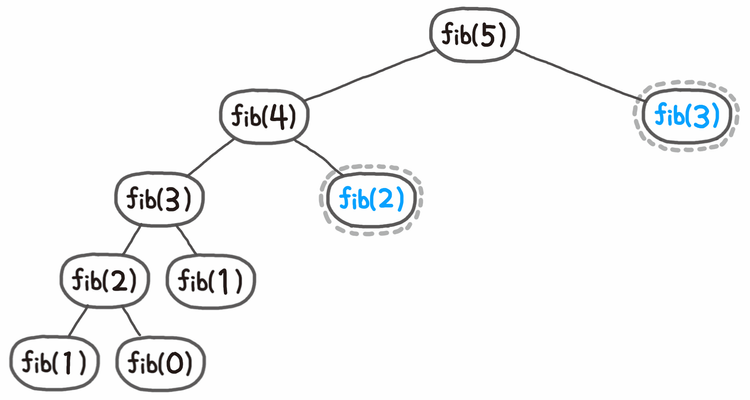

# SW3106 : 프로그래밍 입문 Project #1

### 1-1. Problem1_FlowChart

### 1-2. Problem1_iteration
|점화식|
|:---|
F(n+3) = F(n+2) + Fn (n=1, 2, 3 ...)

F1 = 1, F2 = 2, F3 = 3이라 하고 **10**번째 항의 수를 구한다고 해보자.
|시행수(i)|F(i)|F(i+1)|F(i+2)|F(i+3)|
|:---:|:---:|:---:|:---:|:---:|
|1|1|2|3|4|
|2|2|3|4|6|
|3|3|4|6|9|
|4|4|6|9|13|
|5|6|9|13|19|
|6|9|13|19|28|
|**7**|**13**|**19**|**28**|**41**||

여기서 알 수 있는 것은 시행수가 i일 때, i+3번째 값을 구할 수 있다.
즉, i-3번 반복하면 i번째 값을 구할 수 있다.

[Source Code]

    #include <stdio.h>

    int main() 
    { 
        int a, b, c, d, N, i;

        printf("제 1항(a), 제 2항(b), 제 3항(c), 항의 수(N)을 입력하시오:\n");
        scanf("%d %d %d %d", &a, &b, &c, &N);
        for(i = 1; i <= N-3; i++) {
            d = c + a;
            a = b;
            b = c;
            c = d;
        }
        printf("%d항: %d\n", N, d);

        return 0;
    }
### 1-3. Problem1_recursive
|피보나치 점화식|
|:---|
Fib(n+2) = Fib(n+1) + Fib(n) (n=1, 2, 3 ...)

위와 같이 5번째 피보나치 수열을 구하는 데 함수 f를 호출하는 횟수는 총 15번이다. 위의 예시에서 중복해서 계산하는 값만 따져 봐도 Fib(3)이 2번, Fib(2)가 3번, Fib(1)을 5번, Fib(0)을 3번 계산한다. 15번의 계산 중에 무려 11번을 중복해서 계산하는 셈이다. 비록 위 예시는 비교적 작은 값을 제시했지만, 피보나치 수열을 순진(naive)한 방법으로 구할 경우 시간복잡도는 피보나치 수열의 값에 따라 폭발적으로 증가한다. 즉 O(2^N)다.

하지만 메모이제이션(Memoization) 기법을 사용하면 한 번 계산한 결과를 메모리에 저장해두었다가 꺼내 씀으로써 중복 계산을 방지할 수 있고 이를 이용하면 O(N)이 되며 Fib(5)를 구하는 과정은 위와 같아진다.
[Source Code]

    #include <stdio.h>

    int d[100] = {0};

    int fibo(int a, int b, int c, int n) {
        if (n == 1) 
            return a;
        if (n == 2)
            return b;
        if (n == 3)
            return c;
        if (d[n] != 0)
            return d[n];
        
        return d[n] = fibo(a, b, c, n - 1) + fibo(a, b, c, n - 3);
    }

    int main() {
        int a, b, c, N;

        printf("제 1항(a), 제 2항(b), 제 3항(c), 항의 수(N)을 입력하시오:\n");
        scanf("%d %d %d %d", &a, &b, &c, &N);

        printf("%d항: %d\n", N, fibo(a, b, c, N));

        return 0;
    }

### 2. Problem2
[Source Code]

    #include <stdio.h>
    #include <stdlib.h>

    void print_price(int coffee, int cake, int sandwich);
    int* get_setArray(int coffee, int cake, int sandwich);

    int main() {
        int coffee, cake, sandwich;
        printf("주문하고자 하는 커피, 케잌, 샌드위치의 갯수를 각각 입력하세요:\n");
        scanf("%d %d %d", &coffee, &cake, &sandwich);

        print_price(coffee, cake, sandwich);

        return 0;
    }

    void print_price(int coffee, int cake, int sandwich) {
        int total = 0;
        int* set = get_setArray(coffee, cake, sandwich);
        int price[3] = {4000, 5000, 6000};
        int product_num[3] = {coffee, cake, sandwich};
        char* product[3] = {"커피", "케잌", "샌드위치"};

        printf("품목\t  가격\t 갯수\t  금액\t\n");
        printf("세트\t %5d\t %2d\t %5d\t\n", set[0], set[1], set[2]);
        total += set[2];
        
        int i;
        for(i=0; i<3; i++) {
            if(i == set[3])
                continue;
            int temp_price = price[i] * (product_num[i] - set[1]);
            printf("%s\t %5d\t %2d\t %5d\t\n", product[i], price[i], product_num[i] - set[1], temp_price);
            total += temp_price;
        }
        printf("--------------------------------\n");
        printf("총 지불 금액           %7d\n", total);

    }

    int* get_setArray(int coffee, int cake, int sandwich) {
        int temp[3] = {coffee, cake, sandwich};

        int min = temp[0];
        int i;
        int min_idx = 0;
        for(i=1; i<3; i++) {
            if(min > temp[i]) {
                min = temp[i];
                min_idx = i;
            }
        }

        int *set = (int*)malloc(4);
        set[0] = 12000;
        set[1] = min;
        set[2] = 12000*min;
        set[3] = min_idx;

        return set;
    }
### 3. Problem3
[Source Code]

    #include <stdio.h>

    void binaryFunc(int n);

    int main() {
        int input_num;
        printf("값을 입력해주세요: ");
        scanf("%d", &input_num);

        binaryFunc(input_num);

        return 0;
    }

    void binaryFunc(int n) {
        unsigned short int target = (n&0xFFFF);
        char find = 0;

        for(int i=15; i>-1; i--)
        {
            if(find == 0 && ((target>>i)&0x01) == 0)
            {
            }else{
                find = 1;
                printf("%d", ((target>>i)&0x01));
            }
        }
        printf("\n");
    }

### 4. Problem4
[Source Code]

    #include <stdio.h>
    #define MAX 1000

    int MyFinalArray[MAX] = {0};
    int binaryArray[MAX][MAX] = {0};
    int DP[MAX] = {0};
    void getBinary(int n);
    int getMaxIdx(int* arr);
    void binaryFunc(int n);
    long long int binaryCount(int n);

    int main() {
        int n;
        printf("N을 입력하세요:\n");
        scanf("%d", &n);

        binaryArray[0][0] = 0b1;
        binaryArray[1][0] = 0b10;

        for(int i=2; i<n; i++) {
            int root = 1 << i;
            int idx_1 = getMaxIdx(binaryArray[i-1]);
            int idx_2 = getMaxIdx(binaryArray[i-2]);
            int new_idx = getMaxIdx(binaryArray[i]);
    
            for(int j=0; j<idx_1; j++) 
                binaryArray[i][j] = root + (binaryArray[i-1][j] ^ (1 << (i-1)));
            
            new_idx = getMaxIdx(binaryArray[i]);

            for(int j=0; j<idx_2; j++) 
                binaryArray[i][j+new_idx] = root + binaryArray[i-2][j];
        }

        // 문제 조건에 맞는 배열 만들기
        long long int pinary_cnt = binaryCount(n);
        MyFinalArray[0] = n;
        for(int i=1; i<=pinary_cnt; i++)
            MyFinalArray[i] = binaryArray[n-1][i-1];
        
        
        printf("%d자리 갯수: %lld\n", n, pinary_cnt);
        for(int i=1; i<getMaxIdx(binaryArray[n-1]); i++)
        {	if(i % 10 == 0)
                printf("\n"); 
            binaryFunc(MyFinalArray[i]);
        }
        printf("\n");

        return 0;
    }

    int getMaxIdx(int* arr) {
        int idx = 0;
        for(int i=0; i<MAX; i++)
            if(arr[i] == 0 && arr[i+1] == 0) {
                idx = i;
                break;
            }
        return idx;
    }

    void binaryFunc(int n) {
        unsigned short int target = (n&0xFFFF);
        char find = 0;
        int str_idx = 0;

        for(int i=15; i>-1; i--) {
            if(find == 0 && ((target>>i)&0x01) == 0)
            {
                //printf(" x");
            }else{
                find = 1;
                printf("%d", ((target>>i)&0x01));
            }
        }
        printf(" ");
    }

    long long int binaryCount(int n) {
        if(n == 1) 
            return 1;
        if(n == 2)
            return 1;
        if(DP[n] != 0)
            return DP[n];
        
        return DP[n] = binaryCount(n - 1) + binaryCount(n - 2);
    }
